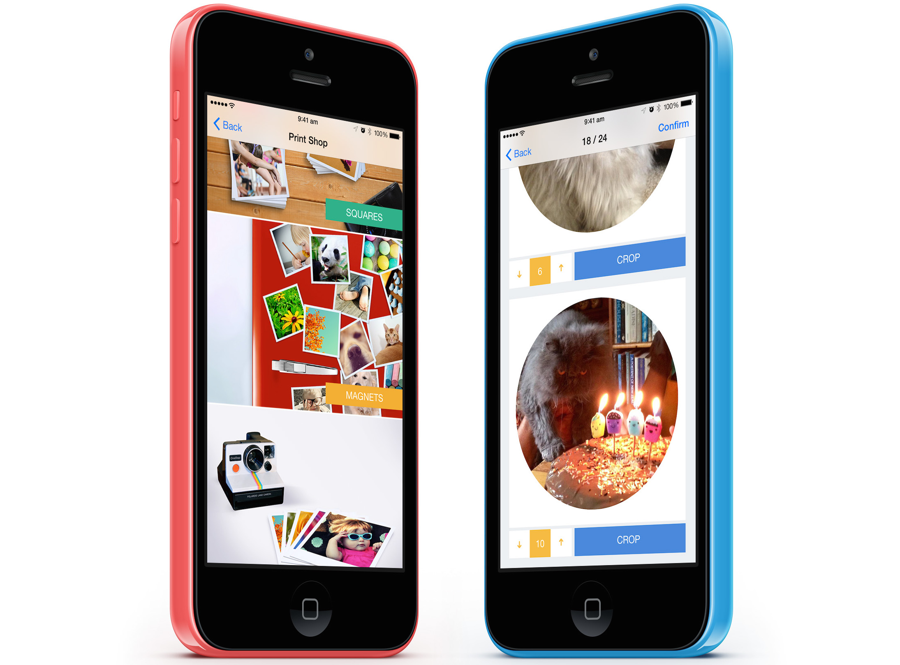

Print Shop User Experience
==============



The Kite Print SDK includes a robust product selection, photo editing and payment experience that's proven to convert well with users. It can take care of everything for you, no need to spend time building any user interfaces.

This is the quickest approach to integration and perfect if you don't want to spend a great deal of time building a custom experience. You can be up & running within minutes!

If you don't want to use or customize the provided experience you can [build your own custom UI](../README.md#custom-user-experience).

_If you haven't already, see the [README](../README.md) for an initial overview and instructions for adding the SDK to your project._

Overview
--------
1. Initialise the SDK
2. Create `OLAsset` objects for the photo(s) you want to turn into awesome personalised products
3. Create and present a `OLKiteViewController` passing it the `OLAsset`(s) you created in Step 2
4. _(Optional)_ Customize `OLKitePrintSDK` to limit which products are available to the user and provide custom photography for the available products.

Sample Code
-----------
1. Initialize the SDK and provide your API Keys (these can be found in the [Credentials](https://www.kite.ly/accounts/credentials/) section of the development dashboard). A typical place for initialization is in your app delegate's `didFinishLaunchingWithOptions:` method.

    ```obj-c
    #import <OLKitePrintSDK.h>
    
    [OLKitePrintSDK setAPIKey:@"REPLACE_WITH_YOUR_API_KEY" withEnvironment:kOLKitePrintSDKEnvironmentSandbox];
    ```

    *Note: Sandbox orders will not be printed and posted. The Sandbox environment is purely for testing during development. If you want to submit a real order that will be printed and posted just use your live API key and the `kOLKitePrintSDKEnvironmentLive` environment*
    

2. Create `OLAsset` representations for every image you want to print. `OLAsset` has many constructors (including ones not listed below) to support any use case you may have.

    ```obj-c
    NSArray *assetsForPrinting = @[
        [OLAsset assetWithURL:[NSURL URLWithString:@"http://psps.s3.amazonaws.com/sdk_static/1.jpg"]],
        [OLAsset assetWithImageAsJPEG:[UIImage imageNamed:@"photo.jpg"]],
        [OLAsset assetWithFilePath:@"..."],
        [OLAsset assetWithALAsset: ...]
    ];
    ```

3. Create and present a `OLKiteViewController` passing it an `NSArray` of `OLAsset` object(s) you created in Step 2

     ```obj-c
    // SomeViewController.m
    #import <OLKitePrintSDK.h>

    @implementation SomeViewController

    - (void)launchPrintShop:(NSArray *)assetsForPrinting {
        OLKiteViewController *vc = [[OLKiteViewController alloc] initWithAssets:assetsForPrinting];
        [self presentViewController:vc animated:YES completion:NULL];
        // or push onto nav stack: [self.navigationController pushViewController:vc animated:YES];
        
    }

    @end
    ```
*Note: You can also present the `OLCheckoutViewController` as a modal view controller or  push it onto the navigation stack.*

4. _(Optional)_ You can customize `OLKitePrintSDK` to limit which products are available to the user and provide custom photography for the available products. See [Customizing the `OLKitePrintSDK`](OLKitePrintSDK.md)

Next Steps
----------

- That's all there is to it from an integration perspective! Submitted print orders will appear in the [developer dashboard](https://www.kite.ly/). You'll also need to register your payment details with us in the dashboard so that we can pay you when your users place orders.
- Alternatively you can [build your own custom checkout UI](../README.md#custom-user-experience) for complete control of the checkout and payment process.
