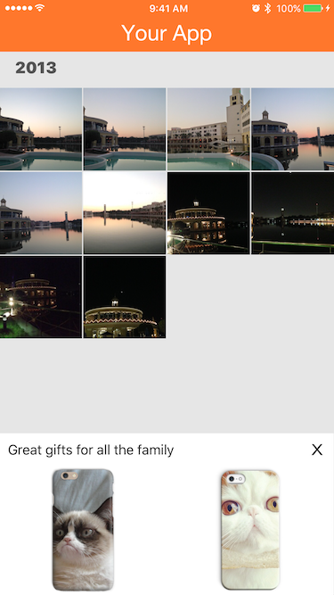

# Promo View

Kite offers a view that can show the user's photos on products to entice them to launch the print shop. You can request and show this in your app outside of the print shop experience of the Kite SDK.



It is delivered as a `UIView` and you can request to have it delivered synchronously or asynchronously when it has finished loading.

Here is the code to load it synchronously:
```obj-c
    OLPromoView *view = [OLPromoView promoViewWithAssets:assets templates:@[@"i6s_case", @"i5_case"]];
    // Show the view here
```

and asynchronously:
```obj-c
[OLPromoView requestPromoViewWithAssets:assets templates:@[@"i6s_case", @"i5_case"] completionHandler:^(OLPromoView *view, NSError *error){
        // Show the view here
    }];
```

**💡Tip💡:** Customize the tagline by setting the `label` property of the `OLPromoView` object.

### Considerations

- We recommend showing the Promo View in a `200` point height and full-width frame and using 2 images and/or templates on an iPhone or 4 on an iPad.
- Not all products are currently supported.
- Only URL `OLAsset` objects are currently supported.
