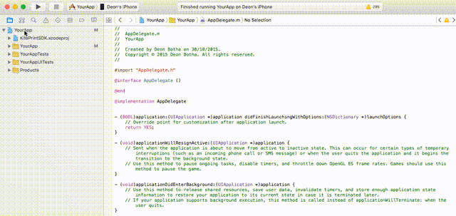
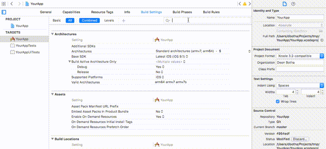
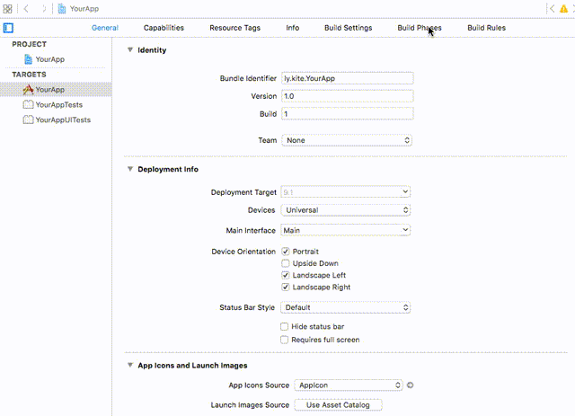
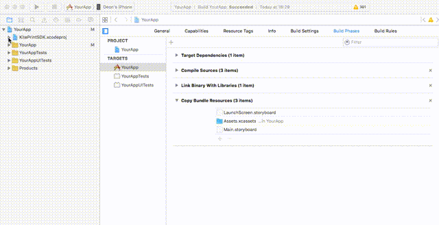

Installing the Kite Print SDK as a git submodule
==============

This document describes the installation process for getting the Kite SDK installed into an iOS project built using Xcode 7.x using git submodules.

Installation via CocoaPods
--------
The recommended installation mechanism for the SDK is via CocoaPods. CocoaPods is an Objective-C library dependency manager that streamlines the process of installing, configuring, and updating third-party libraries.

Please consult the [CocoaPods install guide](https://github.com/OceanLabs/iOS-Print-SDK#cocoapods) if you wish to utilize CocoaPods to install the SDK.

You can learn more about CocoaPods at the website: [http://cocoapods.org/](http://cocoapods.org/)


Step 1. Adding the submodule
-----------
If you do not wish to use CocoaPods then the secondary recommendation is to use a submodule. This allows you to easily track updates using standard Git commands. The first step to installation is to add the submodule to your project:

```
$ cd /path/to/YourApplication
# If this is a new project, initialize git...
$ git init
$ git submodule add https://github.com/OceanLabs/iOS-Print-SDK.git
$ git submodule update --init --recursive
```

Step 2. Add the SDK to your project
-----------
Now that you have cloned the Kite SDK into your project, you need to let your project know about the Kite SDK by adding it to your project Workspace. Find the `KitePrintSDK.xcodeproj` file inside of the cloned iOS-Print-SDK project directory and drag it into the Project Navigator (`⌘+1`).


Step 3. Set Other Linker Flags
-----------

Now that your project is aware of the Kite SDK, you need to configure a few settings and add some required resources to your project's build configuration. Click on your apps project in the Project Navigator to open the Project and Targets configuration pane. 

Add `-ObjC` flag to the `Other Linker Flags` in the `Build Settings` tab.



Step 4. Set Header Search Paths
-----------

Add `$(PROJECT_DIR)/iOS-Print-SDK/Kite-SDK/PSPrintSDK` the `Header Search Paths` in the `Build Settings` tab ensuring you make the item `Recursive`. 

If you added the submodule in a directory outside of the root `PROJECT_DIR` make sure the header search path you add reflects this.



Step 5. Configure Build Phases
-----------
Under the Build Phases tab add `KitePrintSDK` to `Target Dependencies` and `libKiteSDK.a` to `Link Binary with Libraries`



Finally add all resources found under `KitePrintSDK.xcproj/Kite Print SDK/Resources` group to `Copy Bundle Resources`

