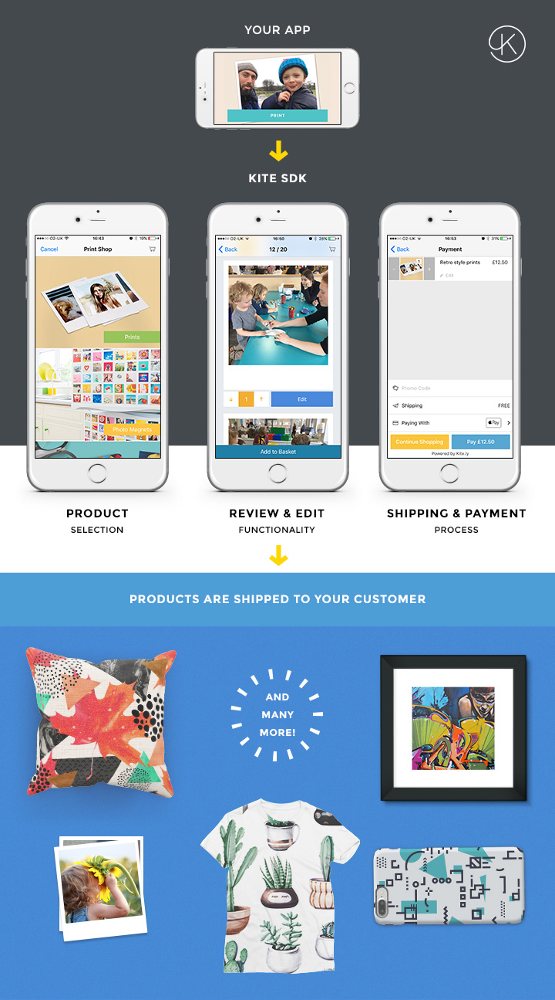

# iOS Print SDK



The Kite Print SDK makes it easy to add print on demand functionality to your app.

Harness our worldwide print and distribution network. We'll take care of all the tricky printing and postage stuff for you!

To get started, you will need to have a free Kite developer account. Go to [kite.ly](https://www.kite.ly) to sign up for free.

## Products

Use print to unlock hidden revenue streams and add value for your users. *In under an hour* you could be using our SDK to print:

- Magnets
- Polaroid Style Prints
- Square Prints
- Postcards
- Frames
- A4 (invoices, letters, etc)
- Large Format (A3, A2, A1)
- Square and Round Stickers
- New products being added monthly

## Features
- Print a wide variety of [products](#products) on demand
- Dynamic & realtime control over the pricing of products in your app pricing using our web [Developer Dashboard](https://www.kite.ly)
- Revenue & order volume analytics available in the web dashboard
- Review, refund or reprint any order within the web dashboard
- Localized currency support
- Worldwide address search & lookup
- No server infrastructure required. We can handle everything for you from processing payments to printing & postage
- Your branding not ours. You can create your own custom checkout & payment UI or customize ours

## Requirements

* Xcode 5 and iOS SDK 7
* iOS 7.0+ target deployment

## Installation
### CocoaPods

[CocoaPods](http://cocoapods.org) is a dependency manager for Objective-C, which automates and simplifies the process of using 3rd-party libraries like the Kite Print SDK in your projects. If you're using it just add the following to your Podfile:

```ruby
pod "Kite-Print-SDK", "~> 1.0"
```

If you'd like to offer your users the opportunity to pay via PayPal in the checkout process also add the following to your Podfile:

```ruby
pod "Kite-Print-SDK/PayPal", "~> 1.0"
```

## Use Cases

The Print SDK supports three primary use cases: **Full**, **Managed Checkout**, and **Custom Checkout**.

### Full

Full mode presents a complete print shop user interface, including a list of available products, beautiful product photography, a chance for the user to review their pics, crop them and lay them out on the product. To use it:

1. [Create `OLAsset` objects](docs/create_asset_object.md) for the photo(s) you want to print
2. Create an `NSArray` of the `OLAsset` object(s) created in step 1.
3. [Create and present or push an `OLKiteViewController`](docs/OLKiteViewController.md) passing it the `NSArray` of `OLAsset` objects.
4. _(Optional)_ [Customize `OLKitePrintSDK`](docs/OLKitePrintSDK.md) to limit which products are available to the user and provide custom photography for the available products.

### Managed Checkout

The Print SDK includes a robust checkout and payment experience that's proven to convert well with users. It can take care of the entire checkout process for you, no need to spend time building any user interfaces.

This is the quickest approach to integration and perfect if you don't want to spend a great deal of time building a custom checkout experience.  To use it:

1. [Create a print order](docs/create_print_order.md) representing the product(s) you wish to have printed and posted
2. [Create and present a `OLCheckoutViewController`](docs/managed_checkout.md) passing it the `OLPrintOrder` object created in Step 1
3. [Register your payment details](https://www.kite.ly/accounts/billing/) with us so that we can pay you when your users place orders

### Custom Checkout
You can build your own UI if you don't want to use or customize the provided checkout and payment experience. You can still use the Print SDK to handle the print order creation and submission:

1. [Create a print order](docs/create_print_order.md) representing the product(s) you wish to have printed and posted
2. [Set the shipping address](docs/shipping.md) to which the order will be delivered
3. [Take payment from the user](docs/payment.md) for the order and submit it to our servers for printing and posting
4. [Register your payment details](https://www.kite.ly/accounts/billing/) with us so that we can pay you when your users place orders

## Credentials & Environments
Your mobile app integration requires different API Keys values for each environment: Live and Test (Sandbox).

You can find these Kite API credentials under the [Credentials](https://www.kite.ly/accounts/credentials/) section of the development dashboard.

### Sandbox

Your Sandbox API Key can be used to submit test print orders to our servers. These orders will not be printed and posted but will allow you to integrate the Print SDK into your app without incurring cost. During development and testing you'll primarily want to be using the sandbox environment to avoid moving real money around.

When you're ready to test the end to end printing and postage process; and before you submit your app to the App Store, you'll need to swap in your live API key.

### Live

Your Live API Key is used to submit print orders to our servers that will be printed and posted to the recipient specified. Live orders cost real money. This cost typically passed on to your end user (although this doesn't have to be the case if you want to cover it yourself).

Logging in to our [Developer Dashboard](https://www.kite.ly) allow's you to dynamically change the end user price i.e. the revenue you want to make on every order. Payment in several currencies is supported so that you can easily localize prices for your users. The dashboard also provides an overview of print order volume and the money you're making.

## Documentation

* These docs in the SDK, which include an overview of usage, step-by-step integration instructions, and sample code
* The sample app included in this SDK
* Header files are thoroughly documented; refer to them as needed for extra details about any given property or parameter
* The [Kite Print API & SDK Developer Docs](https://www.kite.ly/docs/1.1/), which cover error codes and optional server-side integration instructions

## License

Ps iOS Print Studio SDK is available under the MIT license. See the LICENSE file for more info.
