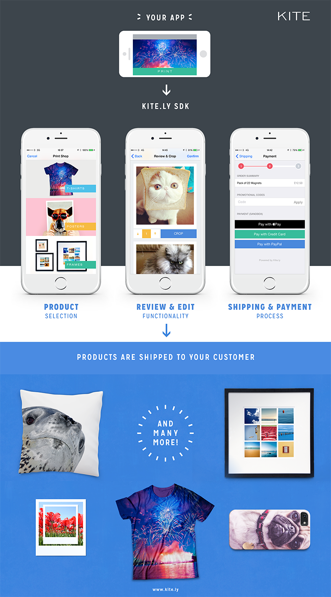
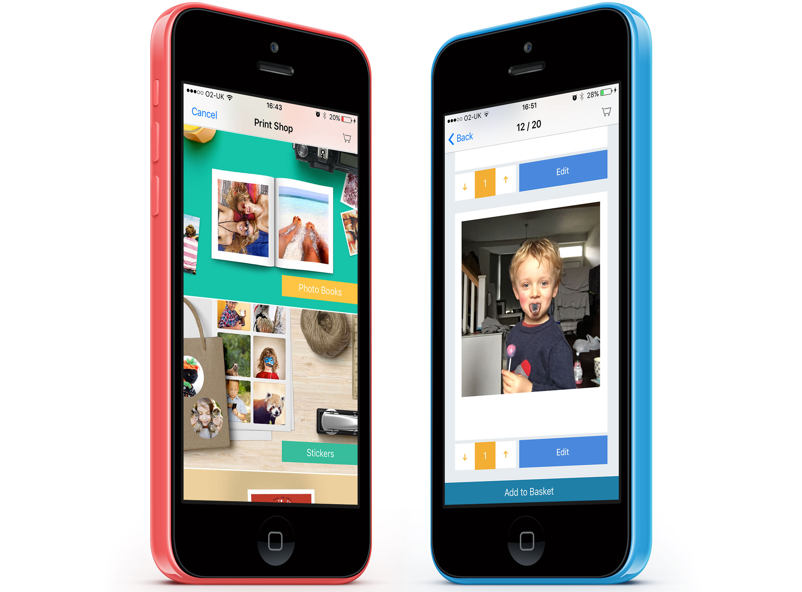

# iOS Print SDK



[](https://circleci.com/gh/OceanLabs/iOS-Print-SDK/tree/master)


[](http://twitter.com/kite_ly)

The Kite Print SDK makes it easy to add print on demand functionality to your app.

Harness our worldwide print and distribution network. We'll take care of all the tricky printing and postage stuff for you!

To get started, you will need to have a free Kite developer account. Go to [kite.ly](https://www.kite.ly) to sign up for free.

## Products

Use our SDK to unlock hidden revenue streams and add value for your users. *In under ten minutes* you could be selling:

- Magnets
- Polaroid Style Prints
- Square Prints
- Postcards
- Frames
- A4 (invoices, letters, etc)
- Large Format Posters (A3, A2, A1)
- Square and Round Stickers
- T-Shirts & other Apparel
- Phone Cases
- New products being added monthly

## Features
- Print a wide variety of [products](#products) on demand
- Dynamic & realtime control over the pricing of products in your app pricing using our web [Developer Dashboard](https://www.kite.ly)
- Revenue & order volume analytics available in the web dashboard
- Review, refund or reprint any order within the web dashboard
- Localized currency support
- Worldwide address search & lookup
- No server infrastructure required. We can handle everything for you from processing payments to printing & postage
- Your branding not ours. You can create your own custom checkout & payment UI or customize ours

## Requirements

* Xcode 7
* iOS 7.0+ target deployment

## Installation

The recommended approach for installing is via the CocoaPods, however we also support adding the SDK via git submodules.

### CocoaPods

[CocoaPods](http://cocoapods.org) is a dependency manager for Objective-C, which automates and simplifies the process of using 3rd-party libraries like the Kite Print SDK in your projects. If you're using it just add the following to your Podfile:

```ruby
pod "Kite-Print-SDK"
pod "Kite-Print-SDK/PayPal"

#Uncomment this next line if you want Instagram photo picking support
#pod "Kite-Print-SDK/Instagram"

#Uncomment this	next line if you want Facebook photo picking support
#pod "Kite-Print-SDK/Facebook"
```

The SDK includes lots of optional functionality enabled via CocoaPod Subspecs so that you can pick and choose your setup.

If you'd like to offer your users the opportunity to add photos via Instagram or Facebook then uncomment the appropriate lines above and follow the instructions to [Enable Facebook & Instagram Photo Selection](Kite-SDK/docs/social_photo_sources.md).

You can also provide your own photo source (for example from within your app or a custom back end). Please read the documentation [here](Kite-SDK/docs/custom_photo_sources.md).

PayPal functionality is also optional although recommended as you'll typically see a higher conversion rate with it.

### Git submodules

See our [Git submodule installation guide](Kite-SDK/docs/submodules.md)

### Quick Integration
We really mean it when we say integration can be done in minutes.
* Step 1: Import the SDK
```
#import <OLKitePrintSDK.h>
```
* Step 2: Set the API key and the environment:
```
[OLKitePrintSDK setAPIKey:@"YOUR_API_KEY" withEnvironment:kOLKitePrintSDKEnvironmentLive]; //Or kOLKitePrintSDKEnvironmentSandbox for testing
```
* Step 3: Create and present Kite:
```
OLKiteViewController *vc = [[OLKiteViewController alloc] initWithAssets:@[[OLAsset assetWithURL:[NSURL URLWithString:@"http://psps.s3.amazonaws.com/sdk_static/4.jpg"]]]];
[self presentViewController:vc animated:YES completion:NULL];
```
* Step 4: Profit!

### iOS 9+ Security

Xcode 7 includes some new security features. In order to connect to the Kite servers you will need to add some exceptions to your project's info plist file. We need to add forward secrecy exceptions for Amazon S3 (which Kite uses) and PayPal (which is used for credit card processing even if you don't opt for PayPal integration). The following is what you need to copy your app's info plist:

```
	<key>NSAppTransportSecurity</key>
	<dict>
		<key>NSExceptionDomains</key>
		<dict>
			<key>paypal.com</key>
			<dict>
				<key>NSExceptionRequiresForwardSecrecy</key>
				<false/>
				<key>NSIncludesSubdomains</key>
				<true/>
			</dict>
			<key>amazonaws.com</key>
			<dict>
				<key>NSExceptionRequiresForwardSecrecy</key>
				<false/>
				<key>NSIncludesSubdomains</key>
				<true/>
			</dict>
		</dict>
	</dict>
```

There are a few more entries to add if you opt for Facebook and Instagram integration as mentioned above. More info [here](Kite-SDK/docs/social_photo_sources.md).

## Use Cases

The Print SDK supports two primary use cases: **Kite Print Shop Experience**, and **Custom User Experience**.

### Kite Print Shop User Experience



The Kite Print SDK includes a robust product selection, photo editing and payment experience that's proven to convert well with users. It can take care of everything for you, no need to spend time building any user interfaces.

This is the quickest approach to integration and perfect if you don't want to spend a great deal of time building a custom experience. You can be up & running within minutes!

To use our Print Shop experience:

1. [Create and present (or push) an `OLKiteViewController`](Kite-SDK/docs/print_shop.md) passing it an array of photos, we'll do the rest.
2. [Register your payment details](https://www.kite.ly/accounts/billing/) with us so that we can pay you when your users place orders


### Custom User Experience
You can build your own UI if you don't want to use or customize the provided Print Shop experience. You can still use the Print SDK to handle the print order creation and submission:

1. [Create a print order](Kite-SDK/docs/create_print_order.md) representing the product(s) you wish to have printed and posted
2. [Set the shipping address](Kite-SDK/docs/shipping.md) to which the order will be delivered
3. [Take payment from the user](Kite-SDK/docs/payment.md) for the order and submit it to our servers for printing and posting
4. [Register your payment details](https://www.kite.ly/accounts/billing/) with us so that we can pay you when your users place orders

## Credentials & Environments
Your mobile app integration requires different API Keys values for each environment: Live and Test (Sandbox).

You can find these Kite API credentials under the [Credentials](https://www.kite.ly/accounts/credentials/) section of the development dashboard.

### Sandbox

Your Sandbox API Key can be used to submit test print orders to our servers. These orders will not be printed and posted but will allow you to integrate the Print SDK into your app without incurring cost. During development and testing you'll primarily want to be using the sandbox environment to avoid moving real money around. To test the sandbox payment you can use your own PayPal sandbox account or contact us at hello@kite.ly

When you're ready to test the end to end printing and postage process; and before you submit your app to the App Store, you'll need to swap in your live API key.

### Live

Your Live API Key is used to submit print orders to our servers that will be printed and posted to the recipient specified. Live orders cost real money. This cost typically passed on to your end user (although this doesn't have to be the case if you want to cover it yourself).

Logging in to our [Developer Dashboard](https://www.kite.ly) allow's you to dynamically change the end user price i.e. the revenue you want to make on every order. Payment in several currencies is supported so that you can easily localize prices for your users. The dashboard also provides an overview of print order volume and the money you're making.

## ApplePay
See our [ApplePay setup documentation](Kite-SDK/docs/applepay.md) if you want to enable checkout via ApplePay.

## Push Notifications

Push notifications are a powerful marketing tool that if used effectively can increase both user engagement and customer life time value by driving more sales within your application. Kite supports sending push notifications to your customers, see our [Push Notification setup documentation](Kite-SDK/docs/push_notifications.md).

## SDK Entry Points
Depending on your use case you might want to launch to a specific product, or even bypass the product selection/creation process entirely and jump straight to the checkout/payment journey. See our [SDK entry point documentation](Kite-SDK/docs/entry_points.md) for more details.

## Documentation

* These docs in the SDK, which include an overview of usage, step-by-step integration instructions, and sample code
* The sample app included in this SDK
* Header files are thoroughly documented; refer to them as needed for extra details about any given property or parameter
* The [Kite Print API & SDK Developer Docs](https://www.kite.ly/docs/1.1/), which cover error codes and optional server-side integration instructions

## Print API
We also have a [REST print API](https://www.kite.ly/docs/1.1/) for those who prefer to invent wheels :)

## License

Kite iOS Print SDK is available under a modified MIT license. See the [LICENSE](Kite-SDK/LICENSE) file for more info.
